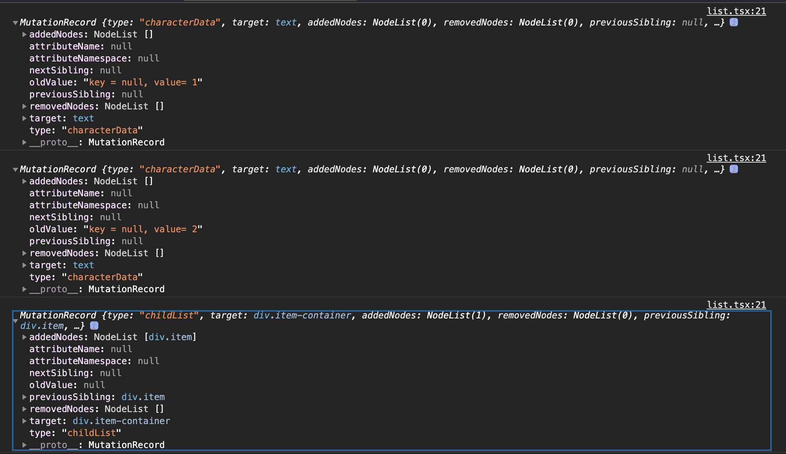
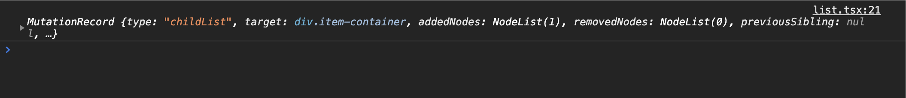
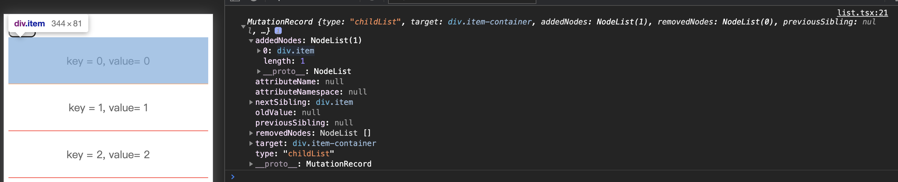
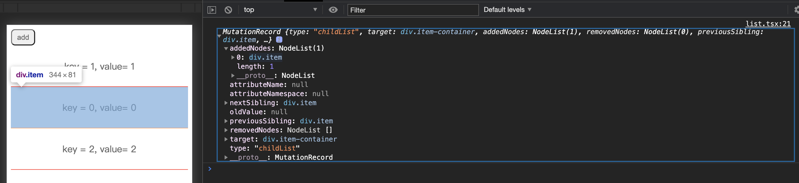
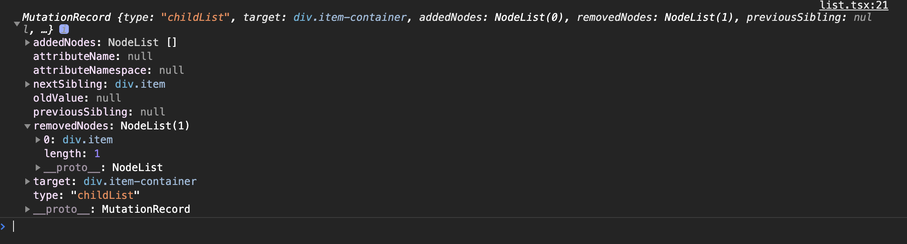
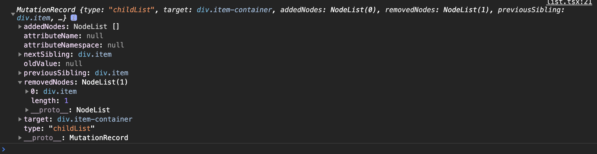
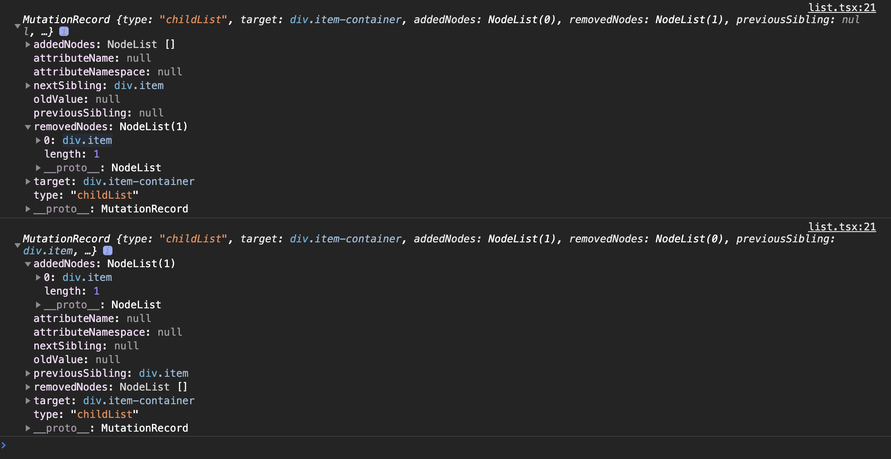

# React diff算法

本文试图通过简单的案例结合源码分析，来看清react diff的神秘面纱。


##  1. key的影响
通常情况下，react都要求我们为列表项添加key，我们通过下面两项实验来验证下key带来的影响。
```
// 首先我们准备一组数据和监听dom变化的回调。
// 1. 数据源
    const listData = {'key':'1', value: '1'}, {'key':'2', value: '2'}
// 2. 监听dom变化, 来反映diff的结果
    let mutationObserver = new MutationObserver((records) => {
      records.forEach(record => {
        console.log(record); // 打印dom变化情况
      })
    });
    const options = {
      attrubutes: true,
      attributeOldValue: true,
      childList: true, // 子元素的变化
      characterData:true, // 节点内容或文本内容变化
      subtree:true, // 所有下属节点的变化
      characterDataOldValue:true, // 如果为true，则表示需要记录变动前的数据值。

    }
    mutationObserver.observe(cRef.current, options);
```


### 情景1：列表子项不添加key
```
// 1. onClick
setListData([{'key':'0', value: '0'}].concat(listData))

// 2. jsx
<div className='container' ref={cRef}>
      <div>
        <button onClick={addOnClick} className='list-btn'>add</button>
      </div>
      <div className='item-container'>
          {
            listData.map(item => {
                const { key, value } = item as DataType;
                return <div className='item' >
                      {`key = null, value= ${value}`}
                </div>

            })
          }
      </div>
    </div>
```

点击add按钮后会向头部插入一个`{'key':'0', value: '0'}`的数据， 此时控制台打印如下:



可以看见插入后`item-container`下面的dom节点都发生了变化，有两个节点改变了文本内容，并且插入了一个新节点, 变化情况如下图:  

| dom |  插入前  | 插入后 |
| -   | - | -|
| domA | {'key':'1', value: '1'} | {'key':'0', value: '0'} |
| domB | {'key':'2', value: '2'} | {'key':'1', value: '1'} |
| domC | 无 | {'key':'2', value: '2'} |


### 情景2： 列表子项添加key
```
listData.map(item => {
                const { key, value } = item as DataType;
                return <div className='item' key={keu} >
                      {`key = ${key}, value= ${value}`}
                </div>

            })
```
同样是点击add按钮后会向头部插入一个{'key':'0', value: '0'}的数据， 此时控制台打印如下:



可以很明显的看出，在添加Key以后，列表中新增加一项，原有的dom没有改变，只是插入了一个新的dom节点来展示新数据。和`情景1`相比，添加key带来的优化显而易见。


## 2. 增删移情景的验证
上面我们验证了添加key带来的好处，下面所有情景都是在key存在的情景下发生的。我们从增删两种大场景出发，看看diff怎么处理的。

### 情景1 在首部添加数据
添加前: `[[{'key':'1', value: '1'}, {'key':'2', value: '2'}]`
添加后: `[[{'key':'0', value: '0'},{'key':'1', value: '1'}, {'key':'2', value: '2'}]`



在头部添加一项，diff结果是在头部插入了一个新dom，已有的dom节点没有变化。

### 情景2  在中间添加数据
添加前: `[[{'key':'1', value: '1'}, {'key':'2', value: '2'}]`
添加后: `[[{'key':'1', value: '1'}, {'key':'0', value: '0'},{'key':'2', value: '2'}]`



在中间添加一项， diff结果是在中间插入了一个新dom，已有的dom节点没有变更。

### 情景3 删除头部数据
删除前: `[[{'key':'1', value: '1'}, {'key':'2', value: '2'}]`
删除后: `[[{'key':'2', value: '2'}]`



删除头部项，diff的结果是删除了这一项对应的dom节点，其他dom节点没有发生变化。

### 情景4 删除中间数据
删除前: `[[{'key':'1', value: '1'}, {'key':'2', value: '2'}, {'key':'3', value: '3'}]`
删除后: `[[{'key':'1', value: '1'},  {'key':'3', value: '3'}]`



删除中间项，diff的结果是删除了这一项对应的dom节点，其他dom节点没有发生变化。

### 情景5 将头部数据移动到尾部
移动前: `[{'key':'1', value: '1'}, {'key':'2', value: '2'}, {'key':'3', value: '3'}, {'key':'4', value: '4'}, {'key':'5', value: '5'}]`
移动后: `[{'key':'2', value: '2'}, {'key':'3', value: '3'}, {'key':'4', value: '4'}, {'key':'5', value: '5'},{'key':'1', value: '1'}]`



将头部项移动到尾部后，key1对应的dom对象对移动到`item-container`的尾部，所以伴随着一次`removedNodes`和一次`addedNodes`。

### 情景六 将尾部数据移动到头部
移动前: `[{'key':'1', value: '1'}, {'key':'2', value: '2'}, {'key':'3', value: '3'}, {'key':'4', value: '4'}, {'key':'5', value: '5'}]`
移动后: `[{'key':'5', value: '5'},{'key':'1', value: '1'}，{'key':'2', value: '2'}, {'key':'3', value: '3'}, {'key':'4', value: '4'}, ]`


这么一串变动，所以我录制了个gif，细致看一看怎么个变化过程。分析下来就是5这个dom节点保持不动，在它前面的节点都发生了移动，dom节点的移动就意味了要先从dom树上卸下来，然后再装上去，5前面有4个节点，故有8个打印记录。


### 小结
上面前五个场景可以看出diff算法可以在数据结构发生改变时，高效的利用已有的dom节点，做出最小的变动。至于第六个场景，去看看源码是怎么回事吧

## 3.源码分析
当然上面的几种场景只是在最简单的场景下对diff算法的测试， 如果是列表中数据类型很多、如果是出现key重复等等，react又是如何处理的了？源码就是最好的解答疑惑的工具。
```
function reconcileChildrenArray(returnFiber, currentFirstChild, newChildren, lanes) {
    // 1. 如果缺失key或者key重复，则console相应的error
    {
      // First, validate keys.
      var knownKeys = null;

      for (var i = 0; i < newChildren.length; i++) {
        var child = newChildren[i];
        knownKeys = warnOnInvalidKey(child, knownKeys, returnFiber);
      }
    }

    var resultingFirstChild = null;
    var previousNewFiber = null;
    var oldFiber = currentFirstChild;
    var lastPlacedIndex = 0;
    var newIdx = 0;
    var nextOldFiber = null;
    // 2. diff算法的第一步， 从开始位置开始，判断element和对应位置的old Fiber是否匹配， 匹配则继续下个位置，否则跳出循环。
    for (; oldFiber !== null && newIdx < newChildren.length; newIdx++) {
      if (oldFiber.index > newIdx) {
        nextOldFiber = oldFiber;
        oldFiber = null;
      } else {
        // 记录下个位置的fiber
        nextOldFiber = oldFiber.sibling;
      }
      // 2.1  判断newIdx位置的child和fiber是否匹配，
      // 1) 如果newFbier === null, 对应2.2处逻辑成立, 则代表newIndex位置的child和fiber不匹配，跳出循环。
      // 2) 如果newFiber != null, 这里面又分两种情况，第一种是复用了对应位置的fiber对象，第二种是生成了新的fiber对象。
      //    如果是第二种情况，则2.3处逻辑成立，会把老的fiber delete掉。
      var newFiber = updateSlot(returnFiber, oldFiber, newChildren[newIdx], lanes);

      // 2.2 如果没有匹配上，则break出去
      if (newFiber === null) {
        if (oldFiber === null) {
          oldFiber = nextOldFiber;
        }

        break;
      }

      if (shouldTrackSideEffects) {
        // 2.3 删除老的fiber
        if (oldFiber && newFiber.alternate === null) {
          // We matched the slot, but we didn't reuse the existing fiber, so we
          // need to delete the existing child.
          deleteChild(returnFiber, oldFiber);
        }
      }
      // 2.4 判断的fiber是否需要移动
      lastPlacedIndex = placeChild(newFiber, lastPlacedIndex, newIdx);
      // 2.5 将新的fiber链接起来
      if (previousNewFiber === null) {
        // TODO: Move out of the loop. This only happens for the first run.
        resultingFirstChild = newFiber;
      } else {
        // TODO: Defer siblings if we're not at the right index for this slot.
        // I.e. if we had null values before, then we want to defer this
        // for each null value. However, we also don't want to call updateSlot
        // with the previous one.
        previousNewFiber.sibling = newFiber;
      }

      previousNewFiber = newFiber;
      oldFiber = nextOldFiber;
    }
    // 2.5 如果children全部找到了fiber, 则删除剩余的fiber。 
    if (newIdx === newChildren.length) {
      // We've reached the end of the new children. We can delete the rest.
      deleteRemainingChildren(returnFiber, oldFiber);
      return resultingFirstChild;
    }

    // 3. diff算法的第二步， 没有剩余old Fiber的情况下，需要为剩下的每个child生成新的Fiber
    //  比如：[1,2] => [1,2,3], 经过步骤2后, 上一轮同一层级有且仅有的两个fiber都被匹配走了，此时olerFiber就是空
    if (oldFiber === null) {
      // If we don't have any more existing children we can choose a fast path
      // since the rest will all be insertions.
      for (; newIdx < newChildren.length; newIdx++) {
        var _newFiber = createChild(returnFiber, newChildren[newIdx], lanes);

        if (_newFiber === null) {
          continue;
        }

        lastPlacedIndex = placeChild(_newFiber, lastPlacedIndex, newIdx);

        if (previousNewFiber === null) {
          // TODO: Move out of the loop. This only happens for the first run.
          resultingFirstChild = _newFiber;
        } else {
          previousNewFiber.sibling = _newFiber;
        }

        previousNewFiber = _newFiber;
      }

      return resultingFirstChild;
    } // Add all children to a key map for quick lookups.

    // 4. 如果此时还剩余fiber, 则根据fiber的key和fiber对象自身生成一个map，供步骤5使用
    var existingChildren = mapRemainingChildren(returnFiber, oldFiber); // Keep scanning and use the map to restore deleted items as moves.

    // 5. diff算法的第三步， 完成剩余child的遍历。
    for (; newIdx < newChildren.length; newIdx++) {
      // 5.1  从步骤4生成的map中寻找key相同fiber，如果type也相同，则复用此olderFIber, 否则生成新fiber；如果没有key相同，则返回null
      var _newFiber2 = updateFromMap(existingChildren, returnFiber, newIdx, newChildren[newIdx], lanes);

      if (_newFiber2 !== null) {
        if (shouldTrackSideEffects) {
          // 5.2 将已经复用的fiber从map中删除。
          if (_newFiber2.alternate !== null) {
            // The new fiber is a work in progress, but if there exists a
            // current, that means that we reused the fiber. We need to delete
            // it from the child list so that we don't add it to the deletion
            // list.
            existingChildren.delete(_newFiber2.key === null ? newIdx : _newFiber2.key);
          }
        }
        // 5.3 判断fiber是否需要移动
        lastPlacedIndex = placeChild(_newFiber2, lastPlacedIndex, newIdx);
        // 5.4 将新的fiber链起来， 这样就可以通过resultingFirstChild访问到所有的同级节点。
        if (previousNewFiber === null) {
          resultingFirstChild = _newFiber2;
        } else {
          previousNewFiber.sibling = _newFiber2;
        }

        previousNewFiber = _newFiber2;
      }
    }

    // 6. 整个children遍历完毕，将步骤四中生成的map中剩余的old fiber delete掉。
    if (shouldTrackSideEffects) {
      // Any existing children that weren't consumed above were deleted. We need
      // to add them to the deletion list.
      existingChildren.forEach(function (child) {
        return deleteChild(returnFiber, child);
      });
    }
    // 7. 返回新fiber链表的头部。
    return resultingFirstChild;
  }
```

<br>
<br>


```
function updateSlot(returnFiber, oldFiber, newChild, lanes) {
    var key = oldFiber !== null ? oldFiber.key : null;
    // 1. 如果child是个字符串或者数字的时候
    if (typeof newChild === 'string' || typeof newChild === 'number') {
      if (key !== null) {
        return null;
      }
      return updateTextNode(returnFiber, oldFiber, '' + newChild, lanes);
    }
     
    if (typeof newChild === 'object' && newChild !== null) {
      switch (newChild.$$typeof) {
        case REACT_ELEMENT_TYPE:
          { 
            // 有相同的key的情况下，这里面分两种，一种是定义了key;一种是没有定义key，此时null === null, 
            if (newChild.key === key) {
              if (newChild.type === REACT_FRAGMENT_TYPE) {
                return updateFragment(returnFiber, oldFiber, newChild.props.children, lanes, key);
              }
              // key 相同的情况下，如果element.type也相同，则更新此fiber;
              // 否则，生成一个新的fiber， oldFiber对象会被标记删除。
              // 这个时候我们想一下没有定义key的情况下，从[1,2,3]变成[1,3,2], 
              // 每个位置上比较的时候key和element.type都匹配上了，oldFiber会被复用，但是节点内容对不上, 导致每个dom节点都需要更新。
              // 还有一种我们平常很容易使用的场景，就是使用array.map((item, index) => {return <div key={index}></div>})生成子元素的时候，
              // 会将索引index作为子元素的key，这个时候如果从数据发生顺序的变
              // 化，也会和上面一样，oldFiber虽然复用了，但是dom节点的内容都需要更新，这里面其实有优化控件， 这也是key在某些场景需要慎重选择的原因。
              return updateElement(returnFiber, oldFiber, newChild, lanes);
            } else {
              return null;
            }
          }

        case REACT_PORTAL_TYPE:
          {
            if (newChild.key === key) {
              return updatePortal(returnFiber, oldFiber, newChild, lanes);
            } else {
              return null;
            }
          }
      }
    return null;
  }
```
很多时候有这样的场景，子元素列表从`[element1,element2,element3]` 变成了 `[element1,element2,element3,element4]`, 就是在后面插入了新的元素，前面的元素没有变化。这个时候`element1`、`element2`、`element3`位置对应的old fiber都可以直接复用，dom也都无需更新。只有element4需要通过生成新的fiber，最后再插入到dom树上， 这个diff过程最终结果只更新了一次dom树。
`updateSlot`方法就能在这种更新尾部数据的场景下发挥很好的作用。

<br>
<br>


```
function updateFromMap(existingChildren, returnFiber, newIdx, newChild, lanes) {
    
    ...

    if (typeof newChild === 'object' && newChild !== null) {
      switch (newChild.$$typeof) {
        case REACT_ELEMENT_TYPE:
          {
            var _matchedFiber = existingChildren.get(newChild.key === null ? newIdx : newChild.key) || null;

            if (newChild.type === REACT_FRAGMENT_TYPE) {
              return updateFragment(returnFiber, _matchedFiber, newChild.props.children, lanes, newChild.key);
            }

            return updateElement(returnFiber, _matchedFiber, newChild, lanes);
          }
      }
    }
    ...
    return null;
  }
```
`updateFromMap`方法会从`key`和`oldFiber`组成的`map`中选择`key`和`ElementType`都相同的fiber进行复用。
<br>
<br>


```
function placeChild(newFiber, lastPlacedIndex, newIndex) {
    // 新fiber更新成对应的下标
    newFiber.index = newIndex;

    var current = newFiber.alternate;

    if (current !== null) {
      // oldIndex, 当前渲染树中节点的下标
      var oldIndex = current.index;
      //    lastPlacedIndex, 前面所有节点中在当前渲染树中的最大下标。
      // 1. 如果 oldIndex < lastPlacedIndex， 则代表当前渲染树中有个index比较
      //    的节点移动到了下个渲染树靠前的位置，那么所有在当前渲染树中排在这个
      //    lastPlacedIndex对应节点前面且被复用的fiber节点都需要标记为 
      //    `Placement`, 对应的dom操作就是从dom树上移除下来，再插入到新的位置，情景六就是这种情况。
      if (oldIndex < lastPlacedIndex) {
        // This is a move.
        newFiber.flags = Placement;
        return lastPlacedIndex;
      } else {
        // 2. 返回当前渲染树中节点的下标。
        // This item can stay in place.
        return oldIndex;
      }
    } else {
      // This is an insertion.
      newFiber.flags = Placement;
      return lastPlacedIndex;
    }
  }
```
`placeChild`方法是渲染树更新前后，子元素位置发生移动的情况下的一种更新策略。
`oldIndex`表示更新前元素的下标，即当前渲染树上节点下标。
`lastPlacedIndex`, 当前层级前面所有复用的节点最大的下标。
这种策略是同级元素如果更新前后相对位置没有发生变化，则复用的fiber无需打上Placement标记. 举个例子方便大家理解：
| 更新前 | 更新后 | placeChild策略 |
| -| - | -|
| [element1, element2, element3] |[element3, element2, element1]| 1. 新元素数组中第一个元素是element3, 它对应的`oldIndex == 2`, 此时lastPlacedIndex 是默认值0， `oldIndex < lastPlacedIndex`不成立, 进入源码的else逻辑,newFiber3无需更新flag， `lastPlacedIndex`会被置成2。<br><br>     2. 接着是新元素数组中第二个元素是element2， 它对应的`olerIndex == 1`, `oldIndex < lastPlacedIndex`成立，进入源码的if逻辑，newFiber2会被打上`Placement`标记，`lastPlacedIndex`还是2。<br><br>         3.最后是新元素数组中第三个元素是element1， 它对应的`olerIndex == 0`, `oldIndex < lastPlacedIndex`成立，进入源码的if逻辑，newFiber1也会被打上`Placement`标记|
 

 ## 4. 结束语
码字不易，且行且珍惜。

